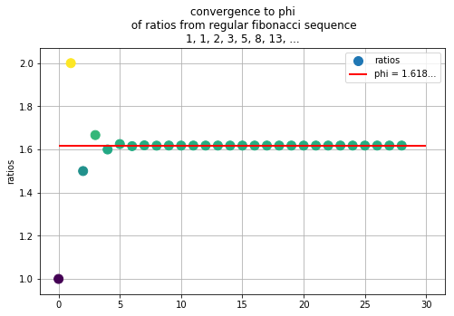
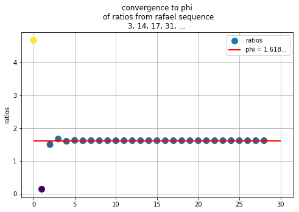

```python
import numpy as np
import matplotlib.pyplot as plt
```

# What is the golden ratio?

The golden ratio is a special number first discovered by taking the ratios of numbers from the Fibonacci Sequence.

Fibonacci Sequence = 1, 1, 2, 3, 5, 8, 13, 21, ....


Ya know, that really famous sequence where we add the previous two terms to get the next term.  

Well, if you take the ratios you get something like this

Fib_Ratio_Sequence = $\frac{1}{1}, \frac{2}{1}, \frac{3}{2}, \frac{5}{3}, \frac{8}{5}, \frac{13}{8}, \frac{21}{13}, ...$

Well, it turns out this converges to a cool number that is called $\phi$


## What makes $\phi$ so cool? Glad you asked


Well $\phi$ has this really cool property that $1 - \phi = 0.6180... = \frac{1}{\phi}$, so 
$$ 1 - \phi = \frac{1}{\phi} $$ 

Using some algebra we can solve for $\phi$ to get 

$$\phi = \frac{1 + \sqrt{5}}{2}$$


So, the Fibonacci Sequence Ratios converge to this beautiful number! **But that's not all!**


## Turns out...
This is true for any sequence where the current term equals the sum of the previous term.  Let's use my sequence called **The Rafael Sequence**.  We'll start with R0=3 and R1=14.

Rafael Sequence = 3, 14, 17, 31, 48, 79, ...

**What do these ratios converge to? Hmmmm....let's find out!**

# Let's make the fibonacci sequence as most commonly seen
## 1, 1, 2, 3, 5, 8, 13, 21, ...


```python
def fib(n):
    if n == 0:
        return 1
    if n == 1:
        return 1
    return fib(n-1) + fib(n-2)
```

### Let's see how the ratios $\frac{F_n}{F_{n-1}}$ converge to get the golden ratio.


```python
# Let's take 50 ratios and 
ratios = []
for i in range(1, 30):
    ratio = fib(i)/fib(i-1)
    ratios.append(ratio)
```


```python
phi = (1 + np.sqrt(5)) / 2
plt.figure(figsize=(8, 5))
plt.grid(zorder=0)
plt.scatter(range(len(ratios)), ratios, label='ratios', s=100, zorder=2, c=np.array(ratios) - phi )
plt.hlines(y=phi, xmin=0, xmax=30, linewidth=2, colors='r', label='phi = 1.618...', zorder=2)
plt.legend()
plt.ylabel("ratios")
plt.title("convergence to phi\n of ratios from regular fibonacci sequence\n1, 1, 2, 3, 5, 8, 13, ...")
plt.show()
```





### Notice this converges to $\phi$ in about 5 iterations  (where the color gets more green)

# Now let's examine the Rafael Sequence


```python
def rafael_sequence(n):
    if n == 0:
        return 3
    if n == 1:
        return 14
    return fib(n-1) + fib(n-2)
```


```python
ratios = []
for i in range(1, 30):
    ratio = rafael_sequence(i)/rafael_sequence(i-1)
    ratios.append(ratio)
```


```python
phi = (1 + np.sqrt(5)) / 2
plt.figure(figsize=(8, 5))
plt.grid(zorder=0)
plt.scatter(range(len(ratios)), ratios, label='ratios', s=100, zorder=2, c=np.array(ratios) - phi )
plt.hlines(y=phi, xmin=0, xmax=30, linewidth=2, colors='r', label='phi = 1.618...', zorder=2)
plt.legend()
plt.ylabel("ratios")
plt.title("convergence to phi\n of ratios from a different fibonacci sequence\n3, 52, 55, 107, 162, ...")
plt.show()
```





### Notice this still converges very quickly, around 3 or 4 ratios.  

So, why is this true? 


Well turns out there's a very elegant proof for it. I'll leave that for another time! :)

Thanks for reading!
