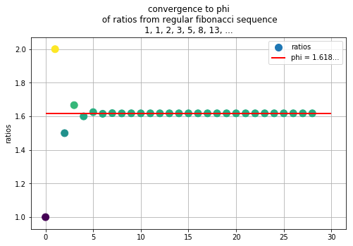
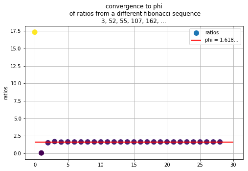

```python
import numpy as np
import matplotlib.pyplot as plt
```

# Let's make the fibonacci sequence as most commonly seen
## 1, 1, 2, 3, 5, 8, 13, 21, ...


```python
def fib(n):
    if n == 0:
        return 1
    if n == 1:
        return 1
    return fib(n-1) + fib(n-2)
```

### Let's see how the ratios $\frac{F_n}{F_{n-1}}$ converge to get the golden ratio.

$$ \phi = \frac{1+\sqrt{5}}{2} \approx 1.6180... $$

A cool fact about $\phi$ is that $1 - \phi = 0.6180... = \frac{1}{\phi}$, so 
$$ 1 - \phi = \frac{1}{\phi} $$ 


```python
# Let's take 50 ratios and 
ratios = []
for i in range(1, 30):
    ratio = fib(i)/fib(i-1)
    ratios.append(ratio)
```


```python
phi = (1 + np.sqrt(5)) / 2
plt.figure(figsize=(8, 5))
plt.grid(zorder=0)
plt.scatter(range(len(ratios)), ratios, label='ratios', s=100, zorder=2, c=np.array(ratios) - phi )
plt.hlines(y=phi, xmin=0, xmax=30, linewidth=2, colors='r', label='phi = 1.618...', zorder=2)
plt.legend()
plt.ylabel("ratios")
plt.title("convergence to phi\n of ratios from regular fibonacci sequence\n1, 1, 2, 3, 5, 8, 13, ...")
plt.show()
```





### Notice this converges to $\phi$ in about 5 iterations  (where the color gets more green)


```python
# Let's start at some new numbers
# Let's start at 3 and 52
def fib_other(n):
    if n == 0:
        return 3
    if n == 1:
        return 52
    return fib(n-1) + fib(n-2)
```


```python
ratios = []
for i in range(1, 30):
    ratio = fib_other(i)/fib_other(i-1)
    ratios.append(ratio)
```


```python
phi = (1 + np.sqrt(5)) / 2
plt.figure(figsize=(8, 5))
plt.grid(zorder=0)
plt.scatter(range(len(ratios)), ratios, label='ratios', s=100, zorder=2, c=np.array(ratios) - phi )
plt.hlines(y=phi, xmin=0, xmax=30, linewidth=2, colors='r', label='phi = 1.618...', zorder=2)
plt.legend()
plt.ylabel("ratios")
plt.title("convergence to phi\n of ratios from a different fibonacci sequence\n3, 52, 55, 107, 162, ...")
plt.show()
```





### Notice this still converges very quickly


```python

```
